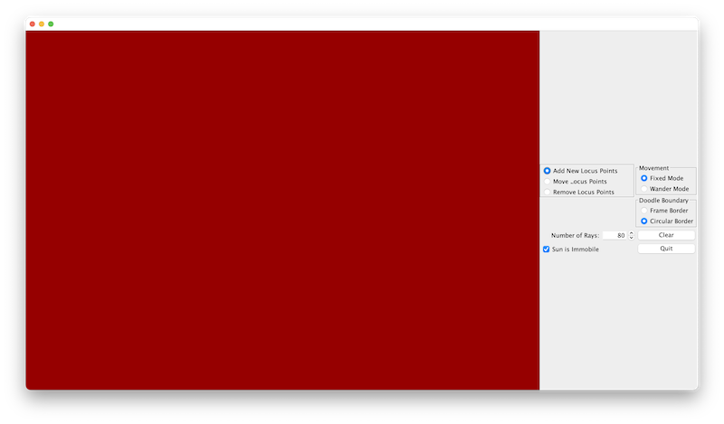
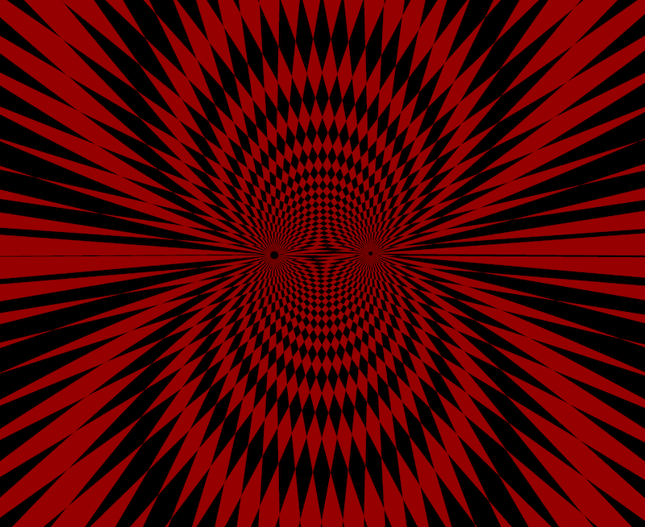
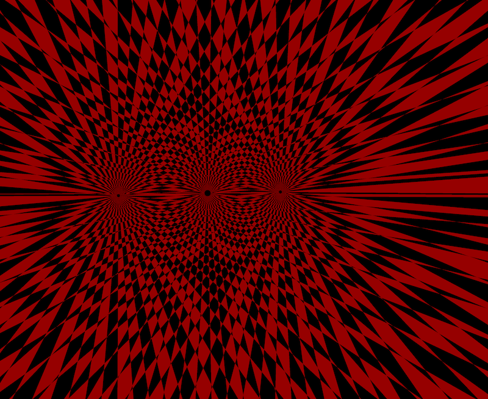
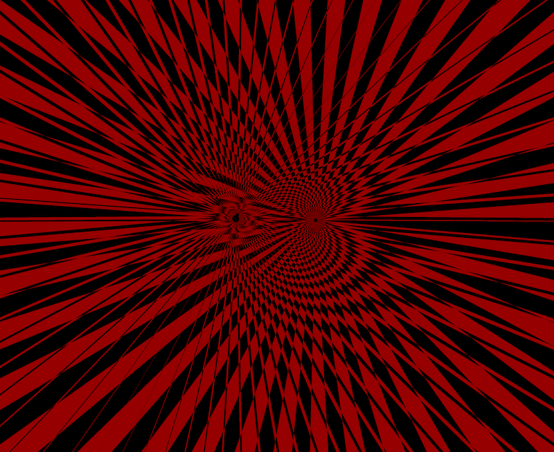

# gravity-doodle
What is this?  It's a multi-body gravity simulation with cool psychedelic graphics.

This assumes you've got a recent version of Java (at least 11).

To run it, clone the repo, and from the repository root, type '`gradlew run`'.

When you start the app, there's a blank screen with a control panel:

Click anywhere on the red area, and you'll create the "sun" - this is typically immobiile, but you can let move by
unchecking the "Sun is immobile" checkbox:

Click again, and you'll add "planets" - each has a random mass, and each sends out it's own rays which XOR with the sun's rays to create nice Morie patterns:

Change the "Movement" setting from fixed to wandering, and the planets start to move with random initial velocities:

Notes:
- You can change the number of rays by changing the "Number of Rays" spinner.  Too few doesn't look as cool, too many gets cluttered 
when there are a lot of planets.
- When a planet goes off-screen, it stops drawing rays
- You can hide the control panel by clicking on the screen with the cmd/windows held down.  Do this with "Full Screen" mode, and it'll fill your entire screen.
- Values for the planetary masses, dt, etc. are in the Constants.kt file
  - Smaller values for dt will make it run more slowly, but the calculations are more accurate
  - Larger values of mass for the planets make them interact more with each other, but can also cause them to fling themselves off the screen.
